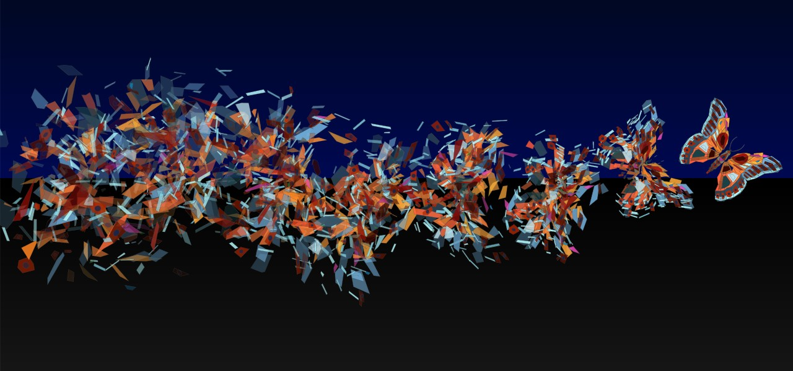
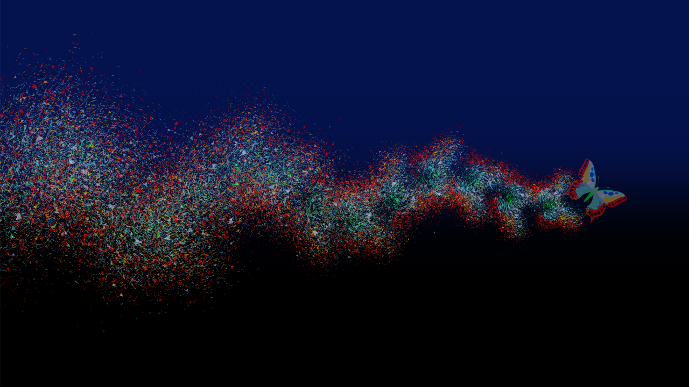

This is my attempt to recreate Ray Stinson's "Coalesce" in py.processing:

(I'm not trying to steal anything... Hopefully this is taken as "Imitation is
the sincerest form of flattery.")

This is Ray's original work:

And, this is my version as it is now.

I still think Ray's is better.
